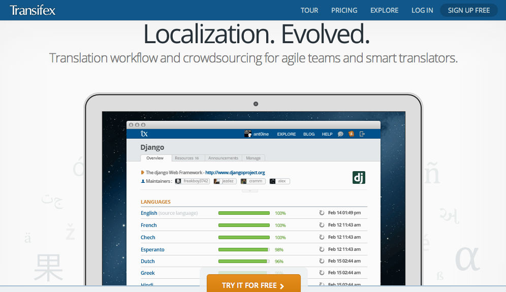
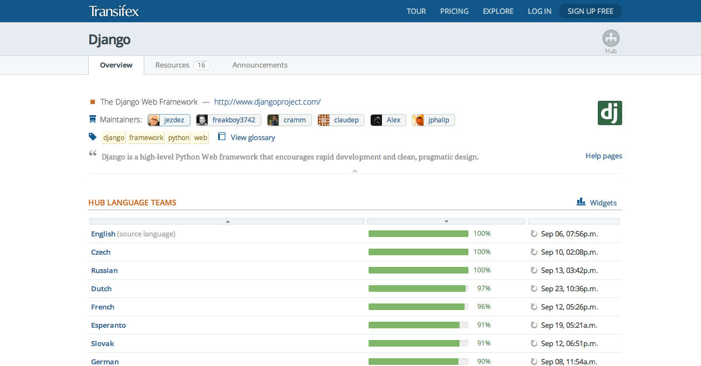
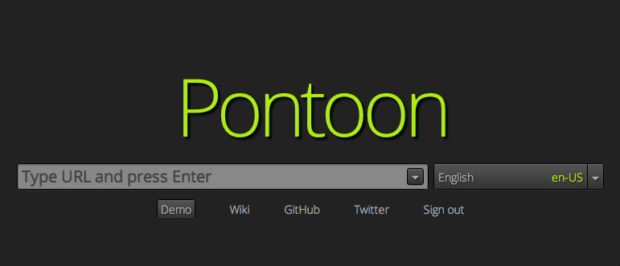
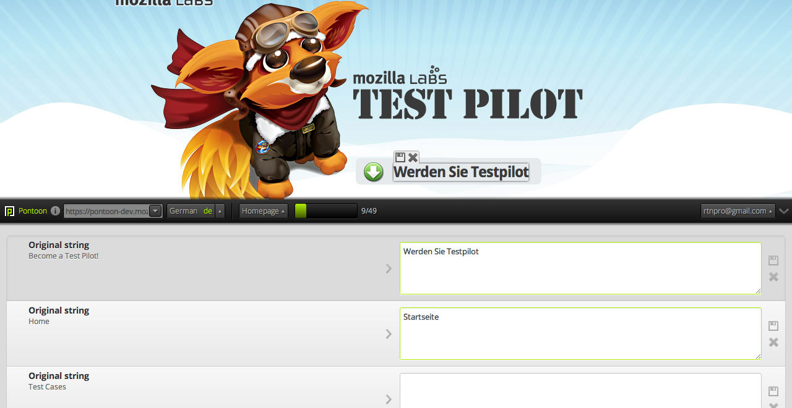

Develop for an international audience
#####################################
:Speaker: Ratnadeep Debnath
:Slides: https://github.com/rtnpro/pycon_india_2012_i18n_and_l10n/
:Event: .. image:: images/pycon_masthead.png

About me
--------

* Developer and QA at www.transifex.com
* rtnpro@{transifex|gmail}.com
* @rtnpro at Freenode, Twitter
* https://github.com/rtnpro
* http://ratnadeepdebnath.wordpress.com

Transifex
---------

* https://www.transifex.com
* A modern localization workflow management system
* A Django based startup
* It's like a Github for localization
* Popular projects (among many) using Transifex:
  Fedora, Django, Dropbox, Pinterest, Opentranslators, Eventbrite, Intel, Nokia ...

Why?
----
* 95% people on the Earth with native language other than English
* 50% internet users speak no English at all
* Around 120 published languages on ``wordpress.com``
* 4X chances to buy from a website in native language
* $25 additional revenue per $1 spent on localization

i18n & l10n
-----------
* i18n: Internationalization
* l10n: Localization

.. image:: images/Globalisationchart.jpg
   :align: right
   :height: 700px
   :width: 700px

Encoding
--------
Rules of thumb

* Always use Unicode rather than ASCII
* Decode in input and encode in output

.. code-block:: python
 # -*- coding: utf-8 -*-
 u = u'Hello world'
 # coversion
 u.encode('utf-8').decode('utf-8')

Timezone
--------
* Use UTC to save time information
* You can use ``pytz`` module for converting timezone info.

Choice of formats
-----------------
* Gettext
* Qt
* YAML
* INI

Use a real format
-----------------
* Plural support
* Context
* Comment
* Suggestions
* Validation

Basic steps for i18n and l10n
-----------------------------
* Mark translation strings
* Extract them (PO files)
* Translate them
* Compile them (MO files)
* Load them in application

Python & Gettext
----------------
.. code-block:: python

    from gettext import gettext as _

    string  = _(u'A sentence to translate')

Simple! Isn't it?

Let's take a look at an example from

https://github.com/rtnpro/pycon_india_2012_i18n_and_l10n/tree/master/examples/python

Initialize
----------

.. code-block:: python

   import gettext

   # Set up message catalog access
   t = gettext.translation('myapplication', 'locale', fallback=True)
   _ = t.ugettext

Usage
-----

.. code-block:: python

   def greet_user(user):
       print _(u'Hello, %s.') % user

Plurals
-------

.. code-block:: python

  def report_children(user):
    print t.ungettext(
        u'You have %s child',
        u'You have %s children',
        children[user]
    ) % children[user]

Extract
-------

.. code-block:: bash

   xgettext -d myapplication -o app.pot l10n.py
   vim app.pot

PO file headers
---------------

.. code-block:: gettext

    # MyApplication
    # Copyright (C) 2012 Apostolis Bessas
    # This file is distributed under the same license as the MyApplication package.
    # Apostolis Bessas <mpessas@transifex.com>, 2012.
    #
    #, fuzzy
    msgid ""
    msgstr ""
    "Project-Id-Version: 0.1\n"
    "Report-Msgid-Bugs-To: http://github.com/mpessas/going_international/issues\n"
    "POT-Creation-Date: 2012-06-30 09:45+0300\n"
    "PO-Revision-Date: YEAR-MO-DA HO:MI+ZONE\n"
    "Last-Translator: FULL NAME <EMAIL@ADDRESS>\n"
    "Language-Team: LANGUAGE <LL@li.org>\n"
    "Language: \n"
    "MIME-Version: 1.0\n"
    "Content-Type: text/plain; charset=UTF-8\n"
    "Content-Transfer-Encoding: 8bit\n"
    "Plural-Forms: nplurals=INTEGER; plural=EXPRESSION;\n"

POT file content
----------------

.. code-block:: gettext

    #: l10n.py:10
    #, python-format
    msgid "Hello, %s."
    msgstr ""

    #: l10n.py:17
    #, python-format
    msgid "You have %s child"
    msgid_plural "You have %s children"
    msgstr[0] ""
    msgstr[1] ""

PO files
--------

.. code-block:: bash

    mkdir -p locale/en/LC_MESSAGES/
    msginit -i app.pot -o locale/en/LC_MESSAGES/en.po -l en
    msgfmt locale/en/LC_MESSAGES/en.po -o \
        locale/en/LC_MESSAGES/myapplication.mo

    mkdir -p locale/it/LC_MESSAGES/
    msginit -i app.pot -o locale/it/LC_MESSAGES/it.po -l it
    msgfmt locale/it/LC_MESSAGES/it.po -o \
        locale/it/LC_MESSAGES/myapplication.mo

    mkdir -p locale/el/LC_MESSAGES/
    msginit -i app.pot -o locale/en/LC_MESSAGES/el.po -l el
    msgfmt locale/el/LC_MESSAGES/el.po -o \
        locale/el/LC_MESSAGES/myapplication.mo

Running
-------

.. code-block:: bash

    bash> LANG=it python l10n.py
    Ciao, John
    You have 1 child
    Ciao, Mary.
    You have 3 children

i18n in Django models
---------------------
.. code-block:: python

    from django.utils.translation import ugettext_lazy as _

    class Person(models.Model):
        name = models.TextField(
            _('Name'),
            help_text=_('First & last name')
        )

i18n in Django templates
------------------------
.. code-block:: html

    

    

.. raw:: pdf

    PageBreak oneColumn

Extract marked strings in Django
~~~~~~~~~~~~~~~~~~~~~~~~~~~~~~~~
.. code-block:: bash

    ./manage.py makemessages

Compile translations
~~~~~~~~~~~~~~~~~~~~
.. code-block:: bash

    ./manage.py compilemessages

Localize dynamic content
------------------------
* Add separate tables to hold localized data: `django-multilingual <http://code.google.com/p/django-multilingual/>`_
* Add new fields in the same table to hold localized data: `django-transmeta <http://code.google.com/p/django-transmeta/>`_
* Use Gettext to localize dynamic data: `django-vinaigrette <https://github.com/ecometrica/django-vinaigrette>`_,
  `django-lingua <https://github.com/geomin/django-lingua>`_

Gotchas with Gettext & Python
-----------------------------
* Issues with ``%`` character in source string. Consider the following scenario.

  .. code-block:: gettext

        #: foo.py: 10
        #, python-format
        msgid "100% translated strings"
        msgstr "100% strings traduzidas"

  ``msgfmt -c`` for the translation file fails.

  Work arounds:

  - Consider removing ``python-format`` flag (**not recommended**)
  - You can modify the source string marked up in source code as:

    .. code-block:: python

        _("%(percent)s translated strings") % {percent: "%d%" % n}

Gotchas with Gettext & Python
-----------------------------
* Are you using new Python format strings?

  .. code-block:: python

        "This is a {format} string".format(format='format')

  Well, Gettext does not recognize
  them and so no validation support from it.
* It's always better to use named format specifiers than positional format specifiers. Makes more sense during translation.

Workflow
--------
* Mark translate strings, export
* Release string freeze
* Translator: VCS checkout
* Translate w/ specialized tools
* Get 'em files back: SSH, email, tickets
* For every friggin release

Challenges
----------
* Too darn hard
* Community isolation
* Quality
* Scalability
* Always more languages, more users

Modern solutions
----------------
* Localization workflow management tools on the cloud, e.g., **Transifex**
* **Pontoon**: A tool from Mozilla for live website localization

What does Transifex offer?
--------------------------
* VCS abstraction
* Easy integration with the help of ``transifex-client``
* Collaboration: teams, crowdsourced, watches, outsourcing
* Translation Memory
* Glossary
* API
* Release management
* Webhooks, autofetch
* Web editor, file formats, 270+ languages
* Free for open source projects

Django on Transifex
-------------------

Pontoon
-------

* Live website localization
* Configurable with various backends like Transifex, Pootle, etc.
* Very intuitive
* Support for various web frameworks: **PHP**, **Django** (others will follow)
* Helps localize non i18n-ized websites
* Open Source
* Contribute: https://github.com/mathjazz/pontoon

Pontoon
-------

Questions?
----------

Thanks :)
---------

